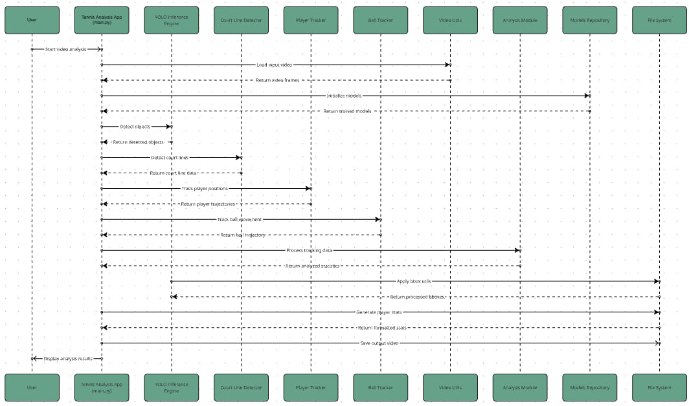
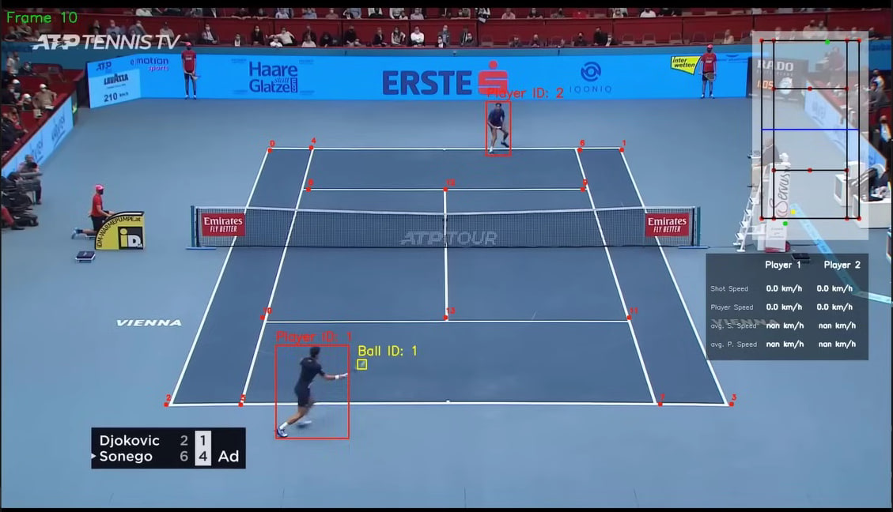

# 🎾 Tennis Analysis Application

This project is a **computer vision-based tennis match analysis system** that performs **player and ball detection, tracking, and court understanding** from broadcast videos.

It leverages **YOLO (You Only Look Once)** for object detection and integrates **custom tracking and court line detection algorithms** to extract advanced match insights.

---

## 🧩 Overview

The Tennis Analysis Application automates the analysis of tennis matches from video input.  
It provides insights such as **player movements**, **ball trajectories**, and **court zones**, supporting coaches, analysts, and sports scientists.

The system uses **YOLO for object detection**, **OpenCV for court and motion analysis**, and **custom tracking modules** to extract match-level data.

---

## 📊 System Architecture

Below is the real system architecture for this project:

1. **Video Input**  
   Raw tennis match video files are placed in the `input_videos/` directory.

2. **Object Detection (YOLO)**  
   The `yolo_inference.py` module detects players and tennis balls in each frame.

3. **Tracking**  
   - `trackers/player_tracker.py`: Tracks player positions and movements.
   - `trackers/ball_tracker.py`: Tracks ball position and velocity.

4. **Court Line Detection**  
   - `court_line_detector/court_line_detector.py`: Identifies court boundaries and zones.

5. **Visualization & Analytics**  
   - `utils/video_utils.py` and `utils/player_stats_drawer_utils.py`: Overlay analytics and stats on video frames.
   - Output videos and analytics are saved in `output_videos/`.

---

### 🖼️ flow Diagram


---

### 🖼️ Output Example



---

## 🧠 Architecture & Modules

The project is modular and organized into key components:

- **YOLO Inference Module** – Detects players and tennis balls in real-time from video frames.
- **Player Tracker** – Tracks player movements across frames using unique object IDs.
- **Ball Tracker** – Tracks ball position and velocity for trajectory analysis.
- **Court Line Detector** – Identifies court boundaries and assists in positional mapping.
- **Video Utilities** – Handles frame reading, writing, and visualization overlays.
- **Training Module** – Includes Jupyter notebooks for model training and dataset configuration.

---

## 🗂️ Project Structure

```
tennis-analysis-app
├── main.py
├── yolo_inference.py
├── analysis/
│   └── ball_analysis.ipynb
├── court_line_detector/
│   └── court_line_detector.py
├── trackers/
│   ├── player_tracker.py
│   └── ball_tracker.py
├── training/
│   ├── tennis_ball_detector_training.ipynb
│   ├── tennis_court_keypoints_training.ipynb
│   └── tennis-ball-detection-6/
│       ├── data.yaml
│       └── ...
├── utils/
│   ├── bbox_utils.py
│   ├── video_utils.py
│   └── player_stats_drawer_utils.py
├── input_videos/
├── output_videos/
├── models/
├── requirements.txt
└── README.md
```

---

## 🛠️ Requirements

- Python 3.8 or later  
- Recommended: GPU-enabled environment for YOLO inference

### Install Python Environment (Optional via Conda)

```bash
conda create -n tennis python=3.8
conda activate tennis
```

### Installation

```bash
git clone <repository-url>
cd tennis-analysis-app
pip install -r requirements.txt
```

---

## 🚀 Usage

1. Place your input videos in the `input_videos/` directory.
2. Run the main script:

```bash
python main.py
```

3. Processed videos and analytics results will appear in `output_videos/`.

---

## 🧩 Tech Stack

- **Languages:** Python
- **Libraries:** OpenCV, PyTorch, YOLOv5, NumPy, Matplotlib
- **Concepts:** Object Detection, Multi-Object Tracking, Court Line Detection, Video Analytics

---

## 🧠  (In Progress)

- Integrate a trajectory prediction model for ball path forecasting.
- Add a match statistics dashboard (e.g., speed, shot accuracy).
- Experiment with DeepSORT for enhanced player tracking.
- Introduce a GUI dashboard for visualization and live analytics.

---

## 🤝 Contributing

Contributions are welcome! Please open an issue or submit a pull request for ideas or improvements.
